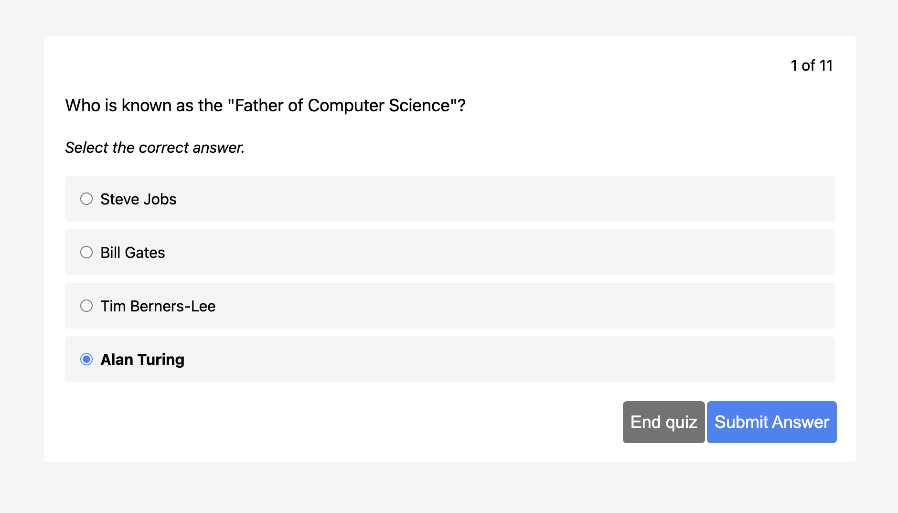
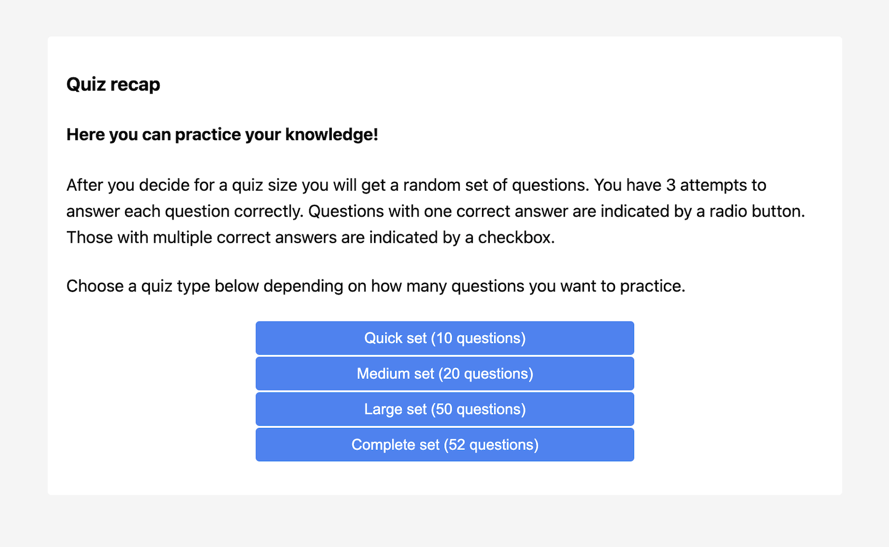
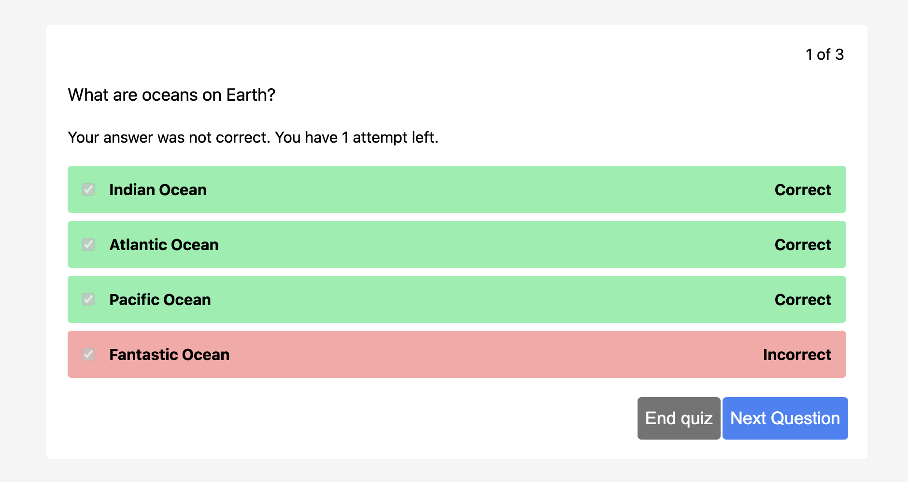
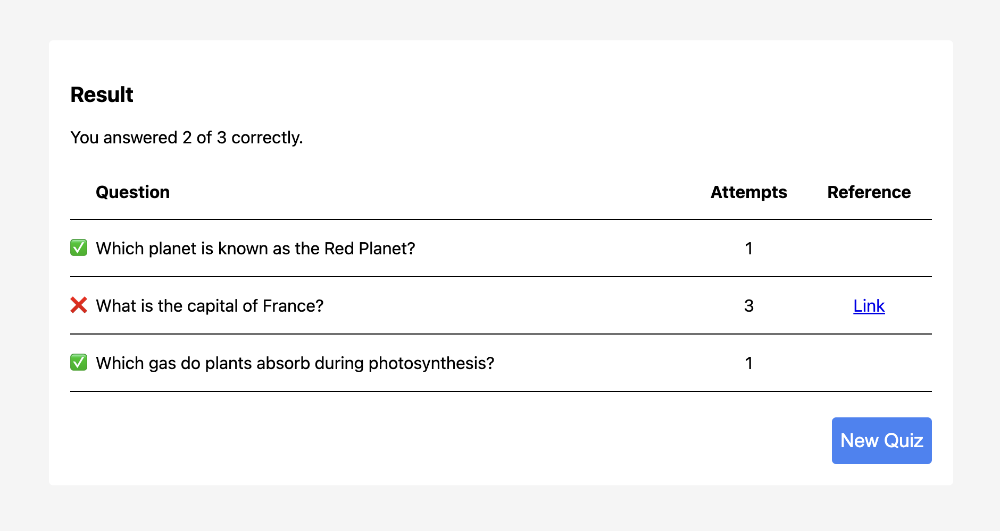

# Quiz recap

Educational app for quiz recapitulation.



## Features

### Choose between set of questions

Prior to starting a quiz, choose the desired number of questions.



### Multiple choice and multiple answers questions

The question type can be multiple-choice or single-choice.

### Instant feedback

After submission, receive immediate feedback with a clear indication of whether your answer was correct.



### Spaced repetition learning technique

A wrong answer will put the question back into the pool up to 3 times, to reinforce memory retention.

### Results page

A concise summary of your quiz performance on the results page upon completion.



## Development setup

1. Clone the repo
2. `npm install`
3. `npm run dev`

There are also tests that can be run with `npm run test`.
Consider running them in watch mode during development `npm run test:watch`.

## How to use as a Library

Install the package:

```node
npm i @openhpi/quiz-recap
```

Initialize the component:

```JS
  import renderQuizRecap from `@openhpi/quiz-recap`;

  const id = 'quiz-recap';
  const data = [ ... ];
  const lang = 'en';

  renderQuizRecap(id, data, lang);
```

### Data Specification

Refer to `src/types.ts` for a detailed specification of the expected data format by the application.
Markdown is supported for questions and answers.

### Options Configuration

Ensure the inclusion of the following options:

- `id` of DOM element where the component will attach itself
- `data` for specification see `Data` type in `src/types.ts`
- `locale` (optional) key for desired localization. Supports English (`'en'`) and German (`'de'`). Will fall-back to English for any
  non-supported language.

### Theming

The App comes with a standard color scheme.

However, you can customize the app's theme to align with corporate design preferences. There are four key colors:

- `primary` for action buttons such as submitting an answer
- `neutral` for backgrounds
- `success` for indicating correct answers and starting a new quiz
- `danger` for destructive actions and indicating a wrong answer

Below, you can find an example.
It outlines the various shades that need to be defined for each color.

```css
.quiz-recap {
  --qr-color-primary: #3b82f6;
  --qr-color-primary-dark: #2563eb;

  --qr-color-neutral: #737373;
  --qr-color-neutral-light: #f5f5f5;
  --qr-color-neutral-dark: #525252;

  --qr-color-success: #22c55e;
  --qr-color-success-light: #86efac;
  --qr-color-success-dark: #16a34a;

  --qr-color-danger: #ef4444;
  --qr-color-danger-light: #fca5a5;
  --qr-color-danger-dark: #dc2626;
}
```

## Contribute

If you want to contribute, you can look for the _Good First Issue_ label.

### Bugs

If you discover some unexpected behavior please file an issue for bugs.
Please make sure to read the existing issues first to avoid duplicates.

### Feature Requests

Please submit an issue to suggest new features.
To help maintainers to determine what to prioritize, you can vote on feature requests by giving them a thumbs up.
