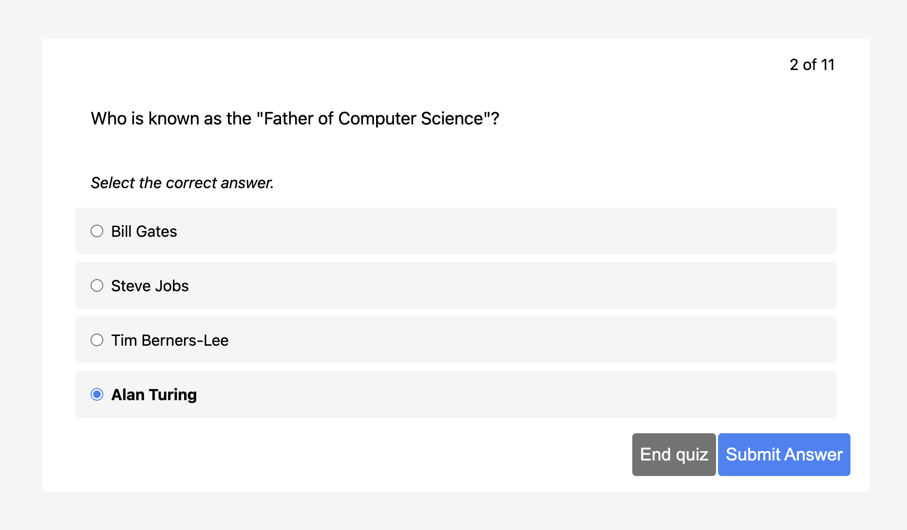

# Quiz recap

Educational app for quiz recapitulation.



## Features

### Choose between set of questions

Prior to starting a quiz, choose the desired number of questions.

### Multiple choice and multiple answers questions

The question type can be multiple-choice or single-choices.

### Instant feedback

After submission, receive immediate feedback with a clear indication of whether your answer was correct.

### Results page

A concise summary of your quiz performance on the results page upon completion.

## How to use

### Data Specification

Refer to `src/types.ts` for a detailed specification of the expected data format by the application.

### Options Configuration

Ensure the inclusion of the following options:

- `elementId` where the app will attach itself
- `lang` (optional) key for desired localization. Will fall-back to English.

### Example

```JS
  import quizRecap from `quizRecap`;

  const selector = 'selector'; // id of DOM element
  const data = [ ... ]; // see `src/types.ts`

  quizRecap(selector, data);
```

## Setup

1. Check out repo
2. `npm install`
3. `npm run dev`

### Tests

`npm run test`.

## Theming

### Colors

The App comes with a standard color scheme.

However, you can theme the App e.g. to fit a corporate design.
To do so, CSS variables defined in `src/index.css` must be overridden.

There are four colors, each must have a base and a lighter shade.

- `primary` for action buttons such as submitting an answer
- `neutral` for backgrounds
- `success` for indicating correct answers and starting a new quiz
- `danger` for destructive actions and indicating a wrong answer

### Example

```css
.quiz-recap {
  --color-primary: #45aaed;
  --color-primary-light: #85c1e9;
  --color-neutral: #ecf0f1;
  --color-neutral-light: #f5f5f5;
  --color-success: #2ecc71;
  --color-success-light: #a9dfbf;
  --color-danger: #e74c3c;
  --color-danger-light: #f2dede;
}
```

## Todo

### Technical

- Build types
- Release as npm package
- Consider changing data structure

### Outstanding Features

The feature set is not complete for release.

#### Required for MVP

- Localization
- "Attempts" feature

#### Nice to have

- Suggest course item on results page (Reference link)
- Show answers on Result page
